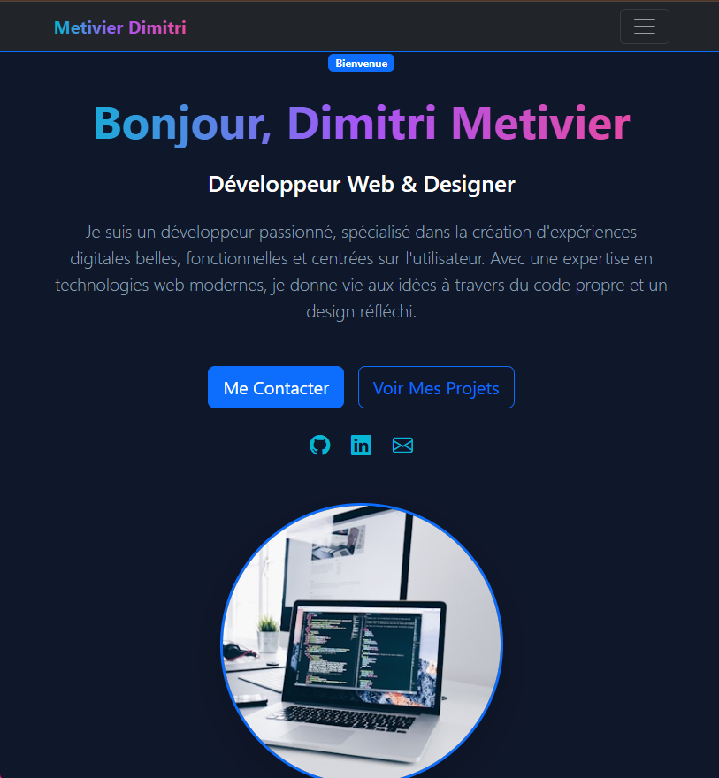

# Portfolio Professionnel - Dimitri Metivier

Portfolio personnel single-page moderne et responsive, développé avec Bootstrap 5 et JavaScript vanilla.

page du figma d'origine : https://www.figma.com/make/3qHgdahPiImzVyLyygbnM9/Professional-Portfolio-Website?node-id=0-1&p=f&t=uyBDOBrSx2Z8cJC8-0&fullscreen=1

## Technologies utilisées
- **HTML5** - Structure sémantique
- **CSS3** - Styles personnalisés avec variables CSS
- **Bootstrap 5.3.2** - Framework CSS (via CDN)
- **Bootstrap Icons** - Bibliothèque d'icônes (via CDN)
- **JavaScript Vanilla** - Interactions classiques
 
## Fonctionnalités
- Design responsive (mobile-first)
- Navigation avec menu hamburger
- Effets hover personnalisés (petit bonus du figma)

## Déploiement

### Option 1 : Ouvrir localement
Ouvrez simplement `portfolio.html` dans votre navigateur.

### Option 2 : GitHub Pages
```bash
git init
git add portfolio.html styles.css script.js README.md
git commit -m "Initial commit"
git branch -M main
git remote add origin https://github.com/votre-username/votre-repo.git
git push -u origin main
```
### Option 3 : lien internet
monportfolioamoi.free.nf





Contactez moi par mail : dimitri.metivier05@gmail.com
